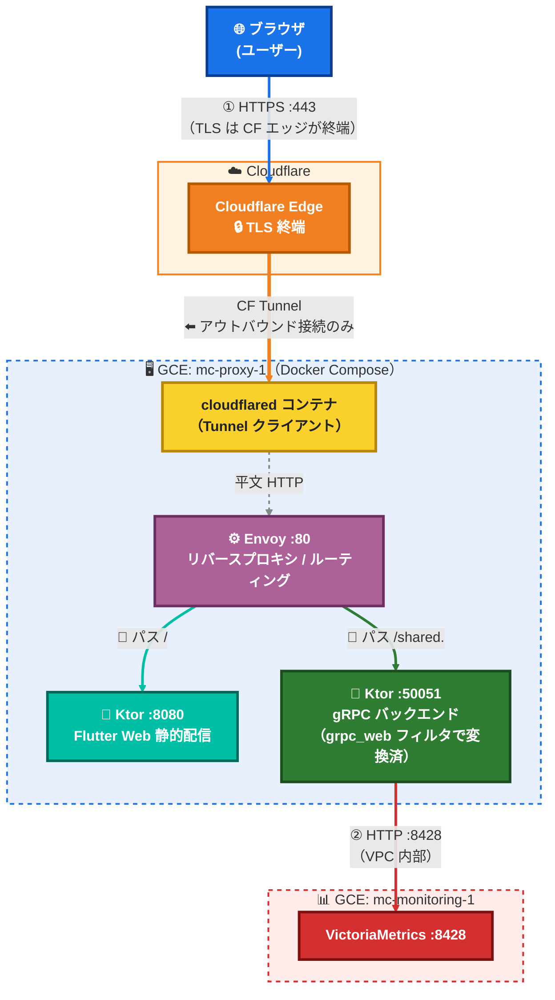
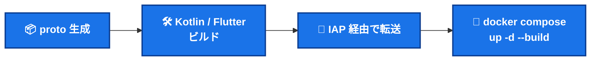

<div align="center">

# 🖥️ Status Platform

**Minecraft サーバー監視ダッシュボード**

Flutter Web フロントエンド × Kotlin (Ktor / grpc-kotlin) バックエンド

[](frontend/)
[](backend/)
[](shared.proto)
[](deploy/envoy.yaml)
[](#1-cloudflare手動)
[](infra/terraform/)
[](#アーキテクチャ)
[](LICENSE)

🌐 公開 URL: **[https://app.tagomori.dev](https://app.tagomori.dev)**（Cloudflare Tunnel 経由・予定）

</div>

> [!NOTE]
> 既存インフラ [Minecraft-on-Kubenates](https://github.com/Tagomori0211/Minecraft-on-Kubenates) に相乗りする形で構築。
> メトリクスソースの VictoriaMetrics（`mc-monitoring-1`）は同リポジトリが管理する**既存リソース**。

---

## 📑 目次

- [アーキテクチャ](#-アーキテクチャ)
- [リポジトリ構成](#-リポジトリ構成)
- [シークレットの取り扱い](#-シークレットの取り扱い)
- [初回セットアップ](#-初回セットアップ)
- [ローカル開発](#-ローカル開発)
- [動作確認（デプロイ後）](#-動作確認デプロイ後)
- [ライセンス](#-ライセンス)

---

## 🗺 アーキテクチャ



### 構成要素

| リソース | 役割 | 管理元 |
|---|---|---|
| 🖥️ **GCE A**（`tagomori-app`） | cloudflared + Envoy + Ktor の3コンテナを Docker Compose で運用 | ✅ 本リポジトリの Terraform が作成 |
| 📊 **GCE B**（`mc-monitoring-1`） | VictoriaMetrics + Grafana | 🔒 **既存リソース**（Minecraft-on-Kubenates 管理）。本リポジトリでは触らない |

### ネットワーク / セキュリティ設計

- 🔐 通信は `tak-vpc`（`10.100.0.0/20`）内部で完結
- 🧱 ファイアウォール `tak-vpc-allow-vm-8428-from-tagomori`（`tagomori` タグ → `minecraft` タグ / tcp:8428）を本リポジトリの Terraform が追加
- 📜 **TLS 証明書はサーバー側に一切不要**（Cloudflare が終端）
- 🚪 GCP ファイアウォールのインバウンドは **IAP SSH のみ**。80/443 は開けない

---

## 📂 リポジトリ構成

```
├── shared.proto                  # gRPC SSOT（MetricsService: GetMetrics / StreamMetrics）
├── frontend/                     # Flutter Web
│   └── lib/
│       ├── screens/status_screen.dart      # メインダッシュボード（30秒ポーリング）
│       ├── services/metrics_service.dart   # HTTP フォールバック（現行）
│       ├── services/metrics_grpc_service.dart  # gRPC-Web（スタブ生成後に有効化）
│       ├── models/ / widgets/ / theme/
│       └── src/generated/        # Dart スタブ出力先（CI生成・git管理外）
├── backend/                      # Kotlin / Ktor / grpc-kotlin
│   └── src/main/kotlin/app/
│       ├── Main.kt               # 1プロセス2ポート（:8080 静的配信 / :50051 gRPC）
│       └── SharedServiceImpl.kt  # VictoriaMetrics クエリ → gRPC レスポンス
├── deploy/
│   ├── docker-compose.yml        # cloudflared + Envoy + Ktor
│   ├── envoy.yaml                # gRPC-Web 変換 / パスルーティング
│   └── Dockerfile.api            # fat JAR を載せる薄いイメージ
├── infra/
│   ├── terraform/                # GCE A・ファイアウォール・Secret skeleton・CI SA
│   ├── cloud-init/tagomori-app.yaml  # 初回プロビジョニング（Docker/Tailscale/.env）
│   └── ansible/                  # ドリフト修正・再適用用（docker/tailscale/app_deploy ロール）
└── .github/workflows/deploy.yml  # CI/CD（IAP SSH 経由デプロイ）
```

---

## 🔑 シークレットの取り扱い

| シークレット | 保管場所 | 備考 |
|---|---|---|
| `TUNNEL_TOKEN` | 🗄️ Secret Manager: `tagomori-tunnel-token` | cloud-init / Ansible が GCE A の `~/app/.env`（mode 600）に展開。git 管理外・rsync 除外 |
| `VICTORIA_METRICS_URL` | 📄 `~/app/.env`（自動生成） | `mc-monitoring-1` の VPC 内部 IP を gcloud で動的取得 |
| CI 用 SA キー | 🐙 GitHub Secrets: `GCP_CI_SA_KEY` | `terraform output -raw ci_sa_key_b64` で取得 |
| Tailscale auth key | 🗄️ Secret Manager: `tailscale-auth-key`（既存・共有） | 既存インフラと同一パターン |

> [!WARNING]
> **`.env` は絶対にコミットしない。** テンプレートは [.env.example](.env.example) を参照。

---

## 🚀 初回セットアップ

### 1. Cloudflare（手動）

1. **Zero Trust > Networks > Tunnels** で Tunnel 作成 → `TUNNEL_TOKEN` を控える
2. **Public Hostname** 追加: `app.tagomori.dev` → `http://envoy:80`（compose サービス名で指定）

### 2. Terraform

```bash
cd infra/terraform
cp terraform.tfvars.example terraform.tfvars   # project_id を記入
terraform init && terraform apply
```

| 作成されるもの | 既存リソース（data source 参照のみ・変更しない） |
|---|---|
| `tagomori-app` VM / 静的IP | `tak-vpc` / `tak-subnet` |
| IAP SSH ファイアウォール / tcp:8428 ファイアウォール | `mc-proxy-sa` |
| `tagomori-tunnel-token` skeleton / CI 用 SA（`tagomori-ci-sa`） | `mc-monitoring-1` |

### 3. シークレット登録

```bash
# Cloudflare で取得したトークンを登録（cloud-init がこれを .env に展開する）
gcloud secrets versions add tagomori-tunnel-token --data-file=- <<< "eyJ..."
```

### 4. GitHub Secrets

| Secret | 値 |
|---|---|
| `GCP_CI_SA_KEY` | `terraform output -raw ci_sa_key_b64` の出力 |
| `GCP_PROJECT_ID` | GCP プロジェクト ID |
| `GCE_ZONE` | `asia-northeast1-b` |
| `GCE_SSH_USER` | CI SA の OS Login ユーザー名（`sa_<数字>` 形式） |

### 5. デプロイ

`main` にプッシュすると CI が以下を自動実行する:



---

## 💻 ローカル開発

```bash
# フロントエンド（HTTP フォールバックで動作。/api/metrics をモックするか CORS 許可が必要）
cd frontend && flutter pub get && flutter run -d chrome

# バックエンド（fat JAR ビルド。proto スタブは Gradle が自動生成）
cd backend && ./gradlew shadowJar

# Dart スタブ手動生成（gRPC-Web へ切り替える場合）
dart pub global activate protoc_plugin
protoc --proto_path=. --dart_out=grpc:frontend/lib/src/generated shared.proto

# envoy.yaml 構文検証
docker run --rm -v $(pwd)/deploy/envoy.yaml:/envoy.yaml envoyproxy/envoy:v1.31.5 --mode validate -c /envoy.yaml
```

---

## ✅ 動作確認（デプロイ後）

| # | 確認項目 | コマンド / 手順 | 期待結果 |
|---|---|---|---|
| 1 | 🌩️ Tunnel 接続 | （GCE A 上で）`docker compose logs cloudflared` | `Registered tunnel connection` が出る |
| 2 | 📄 静的配信 | `curl -I https://app.tagomori.dev/` | `200` + `text/html`、`cf-ray` ヘッダ付きなら CF 経由 |
| 3 | 📊 VictoriaMetrics 到達 | （GCE A 上で）`source ~/app/.env && curl -s "${VICTORIA_METRICS_URL}/health"` | `OK` |
| 4 | 📡 gRPC-Web ルーティング | ブラウザ DevTools > Network で `/shared.MetricsService/GetMetrics` を確認 | `Content-Type: application/grpc-web+proto` で `200` |

---

## 📜 ライセンス

[MIT License](LICENSE)